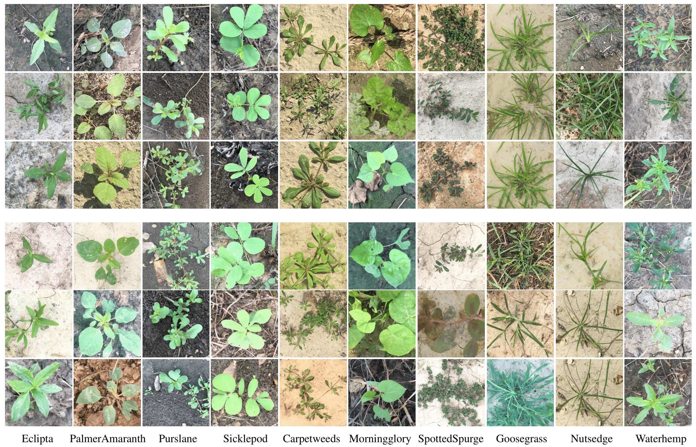
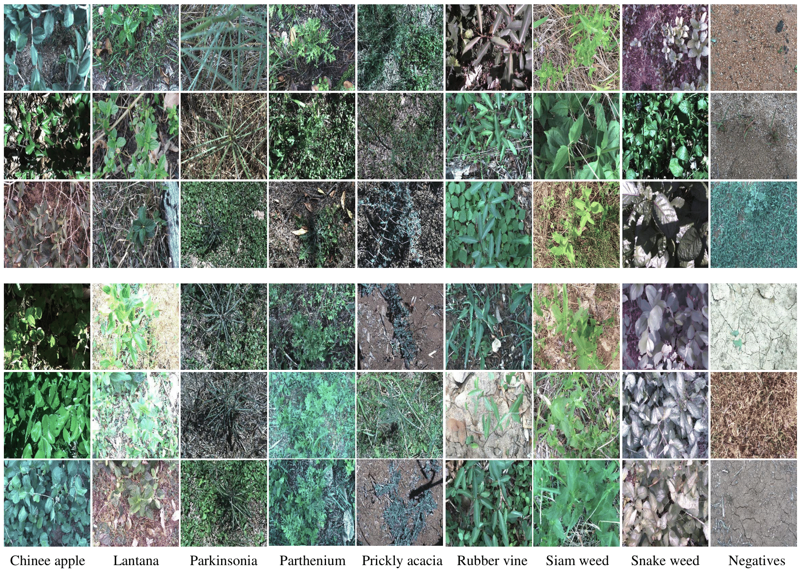
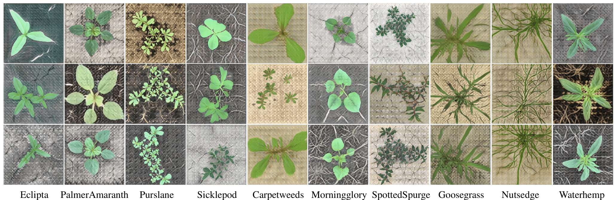
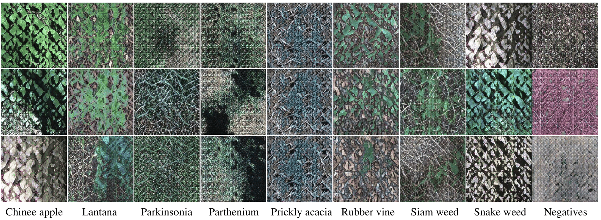
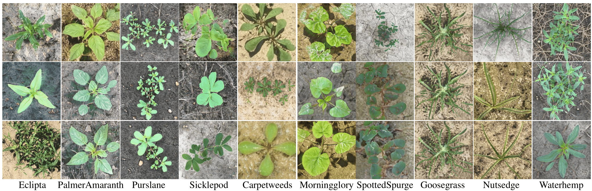
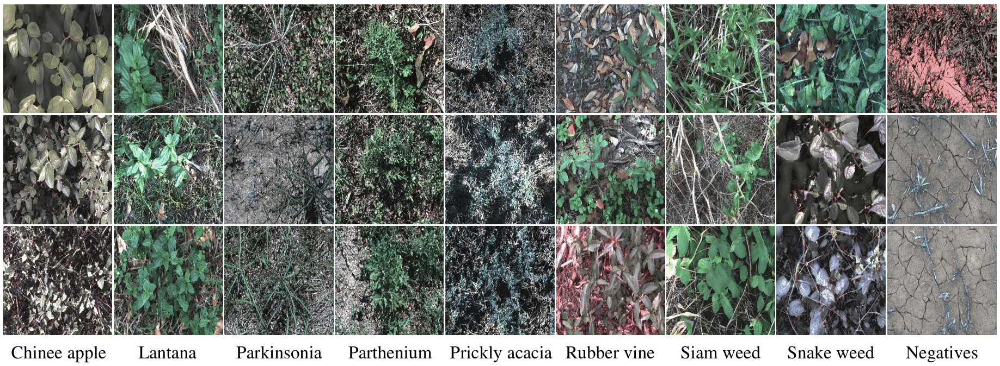
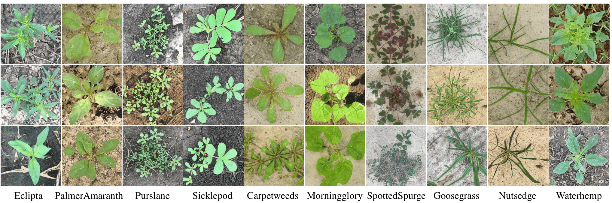

# Deep Data Augmentation for Weed Recognition Enhancement: A Diffusion Models and Transfer Learning Based Approach

Codes will be relased soon!

## Generated Samples
### Diffusion Models

     
       Fig.1 Real (upper) and generated (lower) weed samples for CottonWeedID15 dataset. Each column represents one weed class.

     
       Fig.2 Real (upper) and generated (lower) weed samples for DeepWeeds dataset. Each column represents one weed class.

### GANs
**BigGAN**

     
       Fig.3 Generated weed samples for CottonWeedID15 dataset by BigGAN. Each column represents one weed class.

     
       Fig.4 Generated weed samples for DeepWeeds dataset by BigGAN. Each column represents one weed class.

**StyleGAN2**

     
       Fig.5 Generated weed samples for CottonWeedID15 dataset by StyleGAN2. Each column represents one weed class.

     
       Fig.6 Generated weed samples for DeepWeeds dataset by StyleGAN2. Each column represents one weed class.

**StyleGAN3**

     
       Fig.5 Generated weed samples for CottonWeedID15 dataset by StyleGAN3. Each column represents one weed class.

